---
## Front matter
title: "ОТЧЕТ
ПО ЛАБОРАТОРНОЙ РАБОТЕ  №3"
subtitle: "Система контроля версий Git"
author: "Кудряшов Артём Николаевич"

## Generic otions
lang: ru-RU
toc-title: "Содержание"

## Bibliography
bibliography: bib/cite.bib
csl: pandoc/csl/gost-r-7-0-5-2008-numeric.csl

## Pdf output format
toc: true # Table of contents
toc-depth: 2
lof: true # List of figures
lot: true # List of tables
fontsize: 12pt
linestretch: 1.5
papersize: a4
documentclass: scrreprt
## I18n polyglossia
polyglossia-lang:
  name: russian
  options:
	- spelling=modern
	- babelshorthands=true
polyglossia-otherlangs:
  name: english
## I18n babel
babel-lang: russian
babel-otherlangs: english
## Fonts
mainfont: PT Serif
romanfont: PT Serif
sansfont: PT Sans
monofont: PT Mono
mainfontoptions: Ligatures=TeX
romanfontoptions: Ligatures=TeX
sansfontoptions: Ligatures=TeX,Scale=MatchLowercase
monofontoptions: Scale=MatchLowercase,Scale=0.9
## Biblatex
biblatex: true
biblio-style: "gost-numeric"
biblatexoptions:
  - parentracker=true
  - backend=biber
  - hyperref=auto
  - language=auto
  - autolang=other*
  - citestyle=gost-numeric
## Pandoc-crossref LaTeX customization
figureTitle: "Рис."
tableTitle: "Таблица"
listingTitle: "Листинг"
lofTitle: "Список иллюстраций"
lotTitle: "Список таблиц"
lolTitle: "Листинги"
## Misc options
indent: true
header-includes:
  - \usepackage{indentfirst}
  - \usepackage{float} # keep figures where there are in the text
  - \floatplacement{figure}{H} # keep figures where there are in the text
---

# Цель работы

Целью работы является изучить идеологию и применение средств
контроля версий. Приобрести практические навыки по работе с системой git.

# Задание

Для успешного выполнения лабораторной работы №3 необходимо
проделать ряд действий. Настроить git config в терминале Linux Fedora, создать
SSH ключ, создать репозиторий курса на основе шаблона, организовать
иерархию рабочего пространства. В конце выполнить задания для
самостоятельной работы, в том числе загрузить отчёты по прошлым
лабораторным работам на Github.

# Выполнение лабораторной работы

## Регистрация на Github

Первым шагом необходимо зарегистрироваться на одном из доступных
серверов репозиториев, например, на Github (рис. [-@fig:001]).

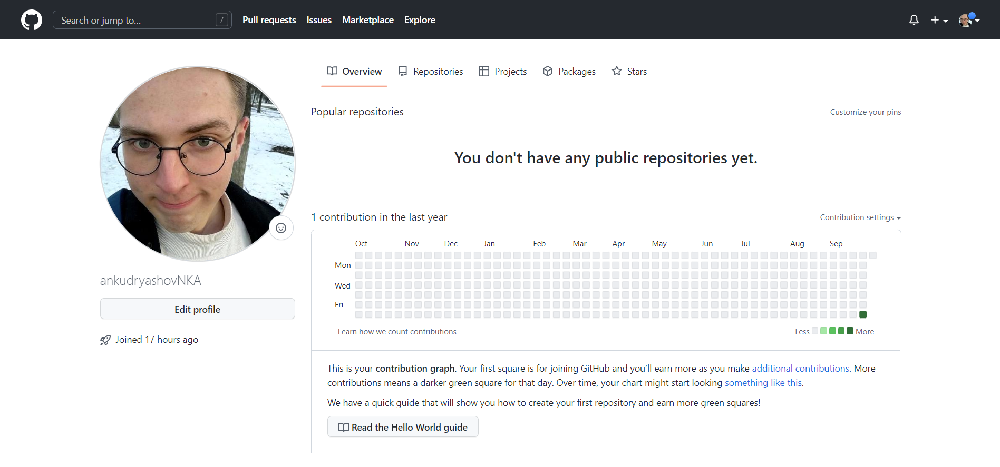{ #fig:001 width=70% }

## Базовая настройка git

Теперь проведём базовую настройку git. Введём ряд команд в командную
строку, в том числе укажем имя пользователя и почту (рис. [-@fig:002]).

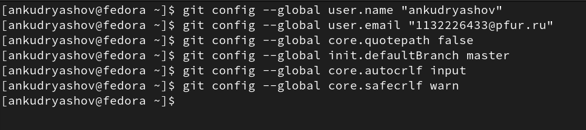{ #fig:002 width=70% }

## Создание SSH ключа

Созданим пару SSH ключей с указанными личными данными (рис. [-@fig:003]).

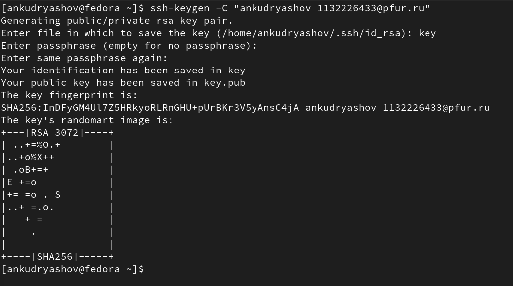{ #fig:003 width=70% }

Загрузим сгенерённый открытый ключ в свою учетныую запись Github (рис. [-@fig:004]).

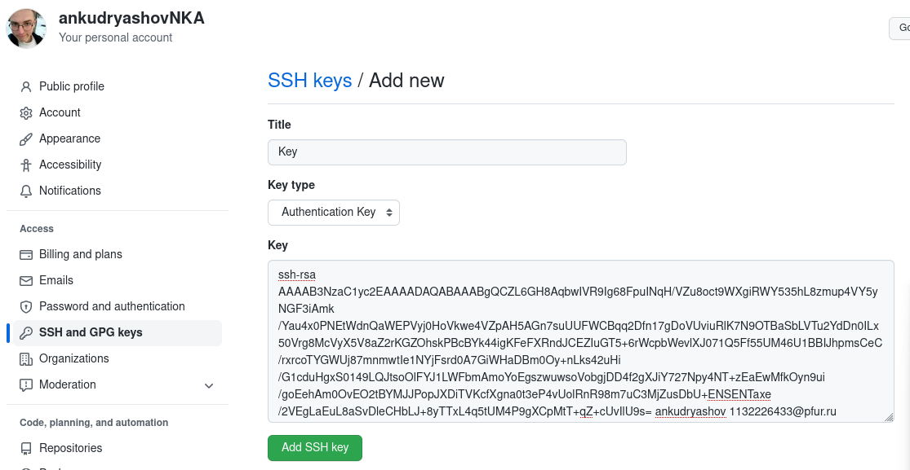{ #fig:004 width=70% }

## Сознание рабочего пространства и репозитория курса на основе шаблона

Создадим каталог для предмета «Архитектура компьютера» (рис. [-@fig:005]).

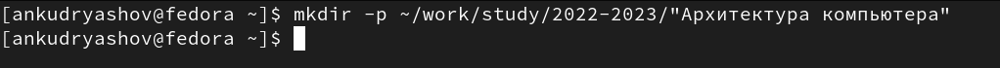{ #fig:005 width=70% }

Создадим репозиторий курса в Github на основе шаблона (рис. [-@fig:006]).

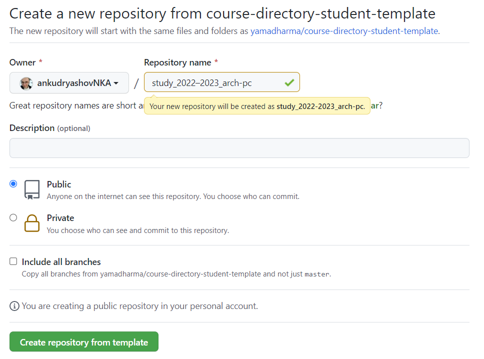{ #fig:006 width=70% }

Теперь клонируем созданный репозиторий. Перейдём в каталог курса и
используем git clone(рис. [-@fig:007]).

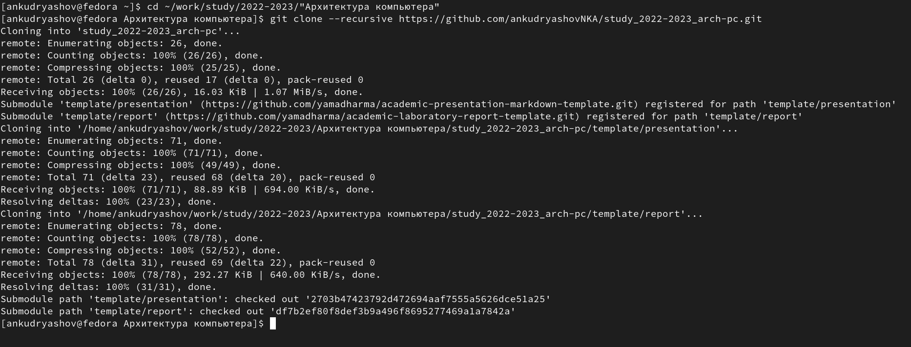{ #fig:007 width=70% }

## Настройка каталога курса

Перейдём в каталог курса. Удалим лишние файлы и создадим
необходимые каталоги (рис. [-@fig:008]).

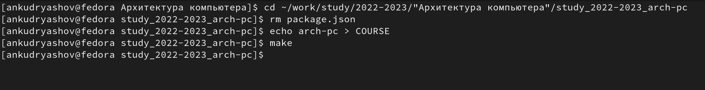{ #fig:008 width=70% }

Отправим файлы на сервер (рис. [-@fig:009] - [-@fig:010]).

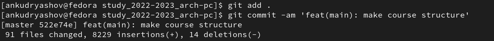{ #fig:009 width=70% }

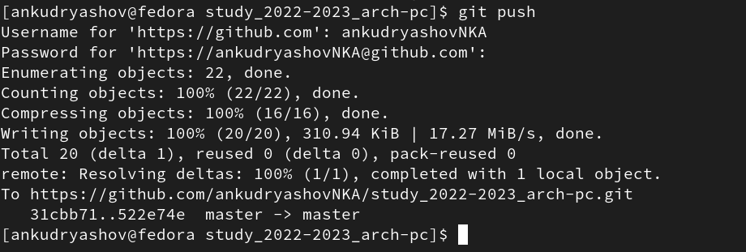{ #fig:010 width=70% }

Иерархии рабочего пространства в локальном репозитории и на странице
github созданы и совпадают.

## Задание для самостоятельной работы

1. Создадим отчет по выполнению лабораторной работы в каталоге
lab03>report (рис. [-@fig:011]).

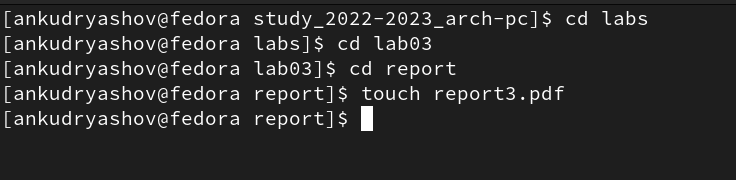{ #fig:011 width=70% }

2. Скопируем отчеты по выполнению предыдущих лабораторных работ в
соответствующие каталоги созданного рабочего пространства (рис. [-@fig:012]).

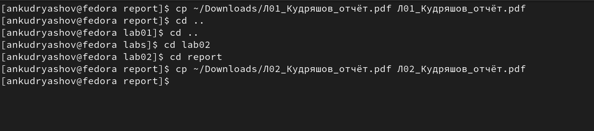{ #fig:012 width=70% }

3. Загрузим файлы на Github (рис. [-@fig:013] - [-fig@:014]).

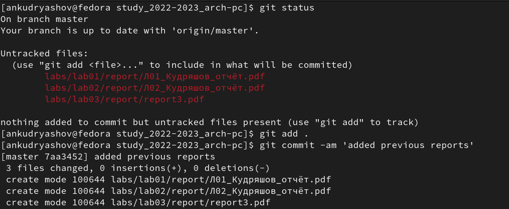{ #fig:013 width=70% }

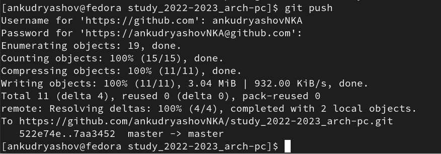{ #fig:014 width=70% }

Как мы видим, изменения были отправлены на git hub (рис. [-@fig:015] - [-@fig:010]).

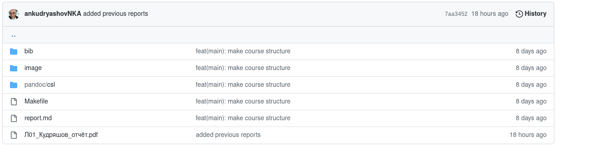{ #fig:015 width=70% }

# Выводы

В ходе выполнения заданий удалось достичь целей, поставленных в
работе. Получилось освоить работу на сервере репозиториев Github, создать
иерархию рабочего пространства на основе шаблона и отправить изменения в
локальной директории на Github.