---
## Front matter
title: "Лабораторная работа №4"
subtitle: "Язык разметки Markdown"
author: "Кудряшов Артём Николаевич"

## Generic otions
lang: ru-RU
toc-title: "Содержание"

## Bibliography
bibliography: bib/cite.bib
csl: pandoc/csl/gost-r-7-0-5-2008-numeric.csl

## Pdf output format
toc: true # Table of contents
toc-depth: 2
lof: true # List of figures
lot: true # List of tables
fontsize: 12pt
linestretch: 1.5
papersize: a4
documentclass: scrreprt
## I18n polyglossia
polyglossia-lang:
  name: russian
  options:
	- spelling=modern
	- babelshorthands=true
polyglossia-otherlangs:
  name: english
## I18n babel
babel-lang: russian
babel-otherlangs: english
## Fonts
mainfont: PT Serif
romanfont: PT Serif
sansfont: PT Sans
monofont: PT Mono
mainfontoptions: Ligatures=TeX
romanfontoptions: Ligatures=TeX
sansfontoptions: Ligatures=TeX,Scale=MatchLowercase
monofontoptions: Scale=MatchLowercase,Scale=0.9
## Biblatex
biblatex: true
biblio-style: "gost-numeric"
biblatexoptions:
  - parentracker=true
  - backend=biber
  - hyperref=auto
  - language=auto
  - autolang=other*
  - citestyle=gost-numeric
## Pandoc-crossref LaTeX customization
figureTitle: "Рис."
tableTitle: "Таблица"
listingTitle: "Листинг"
lofTitle: "Список иллюстраций"
lotTitle: "Список таблиц"
lolTitle: "Листинги"
## Misc options
indent: true
header-includes:
  - \usepackage{indentfirst}
  - \usepackage{float} # keep figures where there are in the text
  - \floatplacement{figure}{H} # keep figures where there are in the text
---

# Цель работы

Целью работы является освоение процедуры оформления отчетов с помощью
легковесного языка разметки Markdown.

# Задание

Для выполнения лаборатроной работы №4 необходимо выполнить ряд действий. В том числе, установить TeX Live, Pandoc и pandoc-crossref. Затем освоить компиляцию шаблона с помощью Makefile. Наконец, выполнить задание для самостоятельной работы: оформить лабораторную работу №3 в формате Markdown и загрузить файлы на Github.

# Выполнение лабораторной работы

## Установка TeX Live

Перейдём в каталог /tmp и скачаем в него архив TeX Live (рис. [-@fig:001]).

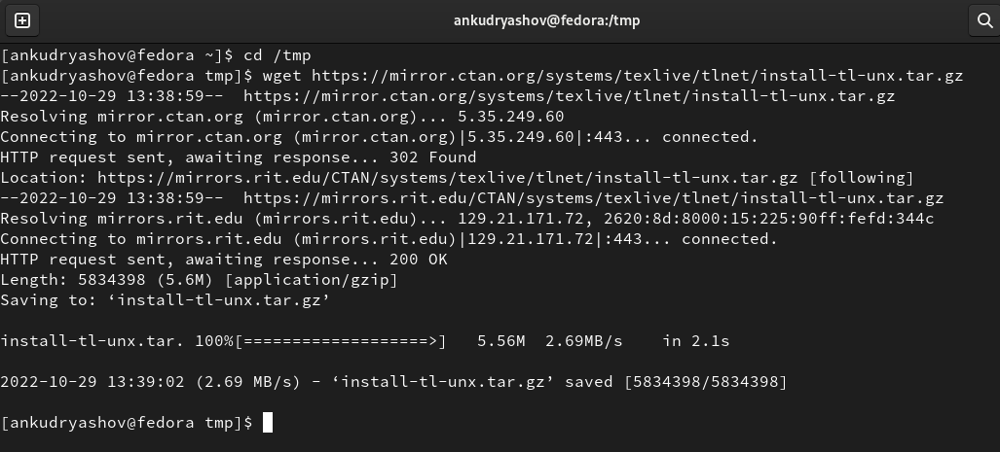{ #fig:001 width=70% }

Распакуем архив и перейдем в распакованную папку (рис. [-@fig:002]).

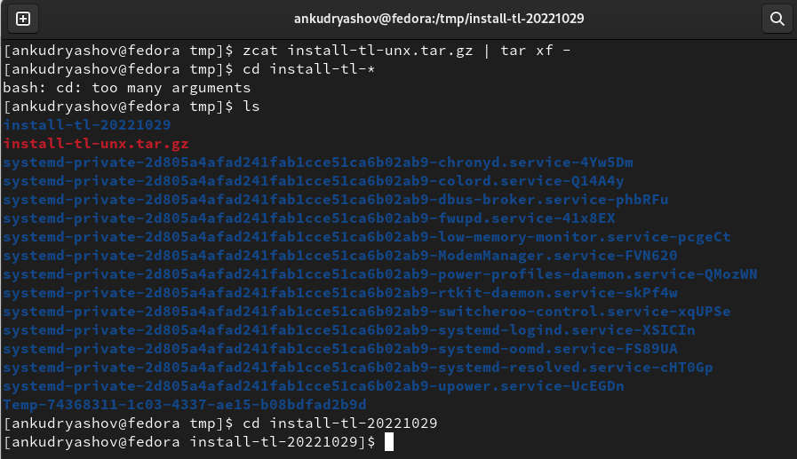{ #fig:002 width=70% }

Запустим скрипт install-tl c root правами (рис. [-@fig:003]).

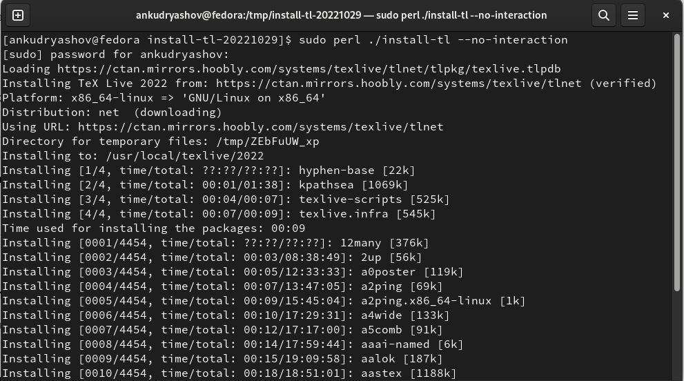{ #fig:003 width=70% }

Спустя 4 часа установка завершена (рис. [-@fig:004]).

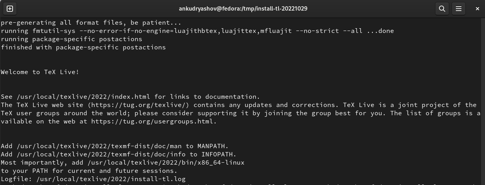{ #fig:004 width=70% }

Добавим /usr/local/texlive/2022/bin/x86_64-linux в PATH для текущей и будущих сессий (рис. [-@fig:005]).

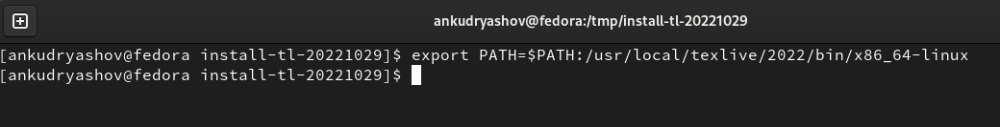{ #fig:005 width=70% }

## Установка Pandoc и pandoc-crossref

Скачаем архив pandoc версии 2.18 (рис. [-@fig:006]).

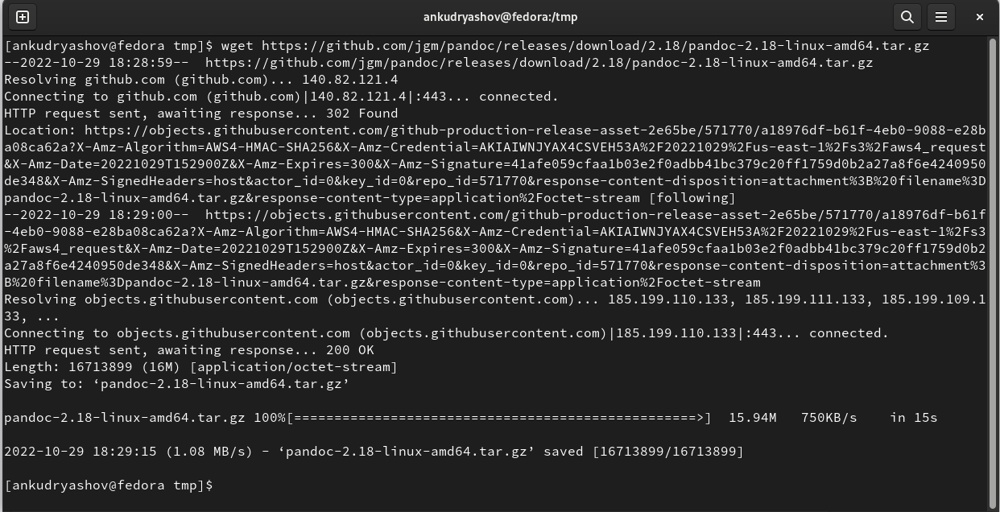{ #fig:006 width=70% }

Скачать архив pandoc-crossref версии 0.3.13.0 (рис. [-@fig:007]).

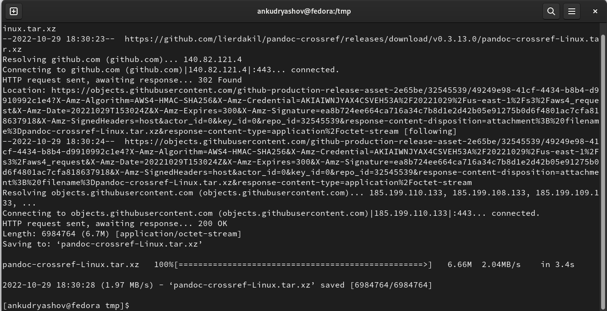{ #fig:007 width=70% }

Распакуем архивы (рис. [-@fig:008]).

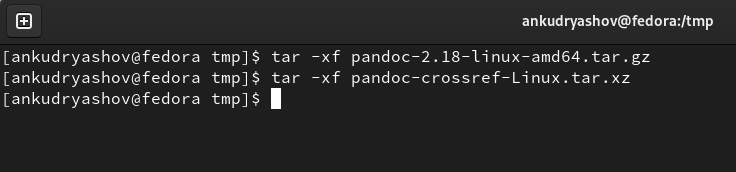{ #fig:008 width=70% }

Скопируем файлы pandoc и pandoc-crossref в каталог /usr/local/bin/ (рис. [-@fig:009]).

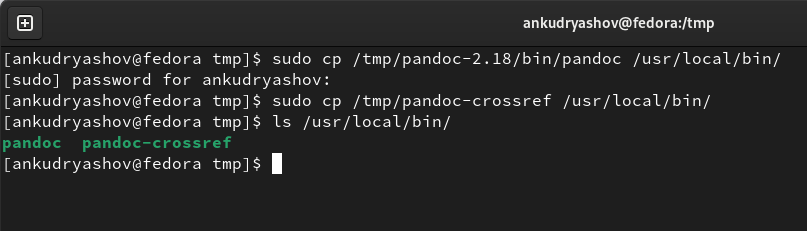{ #fig:009 width=70% }

## Работа с Makefile

Перейдём в каталог курса сформированный при выполнении лабораторной работы №3 и обновим локальный репозиторий (рис. [-@fig:010]).

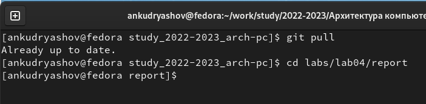{ #fig:010 width=70% }

Перейдём в каталог с шаблоном отчета по лабораторной работе №4 и проведём компиляцию шаблона с использованием Makefile (рис. [-@fig:011]).

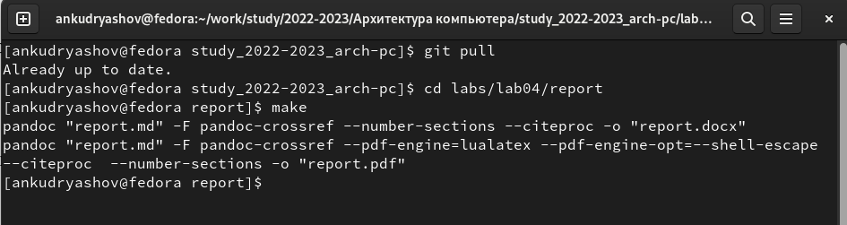{ #fig:011 width=70% }

Как мы видим, команда сработала корректно (рис. [-@fig:012]).

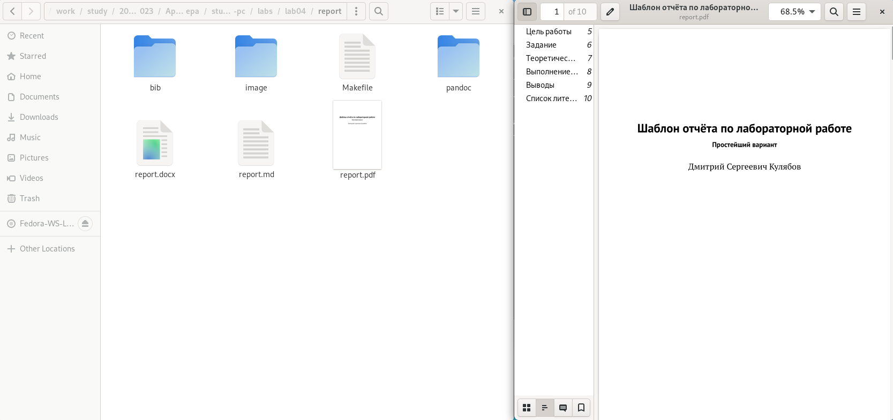{ #fig:012 width=70% }

Удалим полученные файлы с помощью команды make clean (рис. [-@fig:013]).

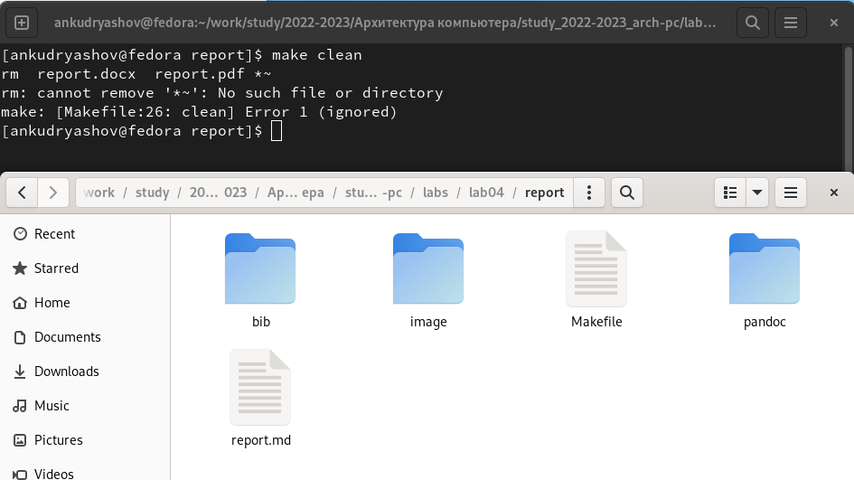{ #fig:013 width=70% }

Открое файл report.md с помощью gedit (рис. [-@fig:011]).

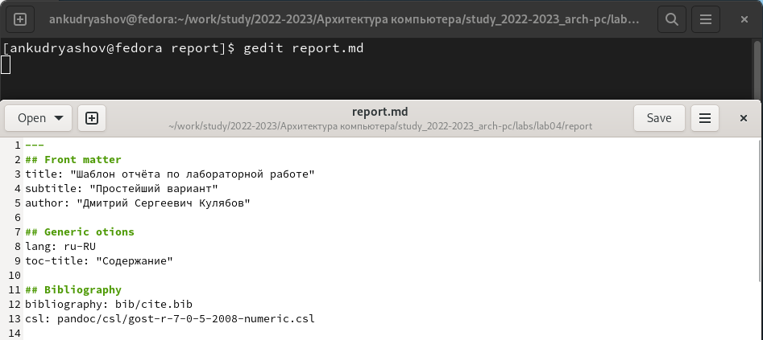{ #fig:014 width=70% }

Заполним и скопмилируем отчет и загрузим файлы на Github.

## Задание для самостоятельной работы

Оформим лабораторную работу №3 в формате Markdown. Отредактируем файл report.md и применим команду Makefile (рис. [-@fig:015]).

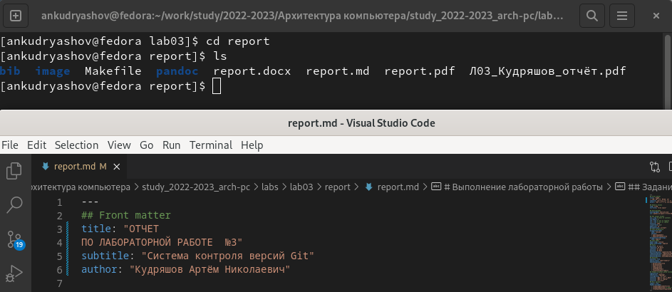{ #fig:015 width=70% }

Отправим изменения на Github (рис. [-@fig:016]).

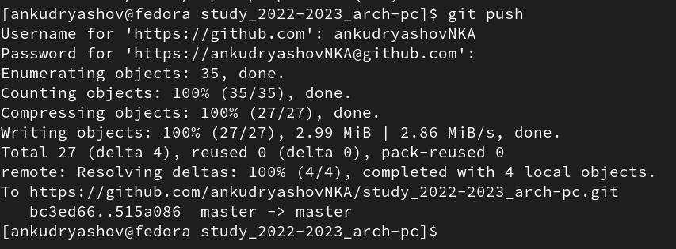{ #fig:016 width=70% }

# Выводы

В ходе выполнения лабораторной работы удалось полностью выполнить поставленное задание. Установить TeX Live и Pandoc, освоить основы языка Markdown. 