---
## Front matter
title: "ОТЧЕТ
ПО ЛАБОРАТОРНОЙ РАБОТЕ  №5"
subtitle: "Создание и процесс обработки программ на языке ассемблера NASM"
author: "Кудряшов Артём Николаевич"

## Generic otions
lang: ru-RU
toc-title: "Содержание"

## Bibliography
bibliography: bib/cite.bib
csl: pandoc/csl/gost-r-7-0-5-2008-numeric.csl

## Pdf output format
toc: true # Table of contents
toc-depth: 2
lof: true # List of figures
lot: true # List of tables
fontsize: 12pt
linestretch: 1.5
papersize: a4
documentclass: scrreprt
## I18n polyglossia
polyglossia-lang:
  name: russian
  options:
	- spelling=modern
	- babelshorthands=true
polyglossia-otherlangs:
  name: english
## I18n babel
babel-lang: russian
babel-otherlangs: english
## Fonts
mainfont: PT Serif
romanfont: PT Serif
sansfont: PT Sans
monofont: PT Mono
mainfontoptions: Ligatures=TeX
romanfontoptions: Ligatures=TeX
sansfontoptions: Ligatures=TeX,Scale=MatchLowercase
monofontoptions: Scale=MatchLowercase,Scale=0.9
## Biblatex
biblatex: true
biblio-style: "gost-numeric"
biblatexoptions:
  - parentracker=true
  - backend=biber
  - hyperref=auto
  - language=auto
  - autolang=other*
  - citestyle=gost-numeric
## Pandoc-crossref LaTeX customization
figureTitle: "Рис."
tableTitle: "Таблица"
listingTitle: "Листинг"
lofTitle: "Список иллюстраций"
lotTitle: "Список таблиц"
lolTitle: "Листинги"
## Misc options
indent: true
header-includes:
  - \usepackage{indentfirst}
  - \usepackage{float} # keep figures where there are in the text
  - \floatplacement{figure}{H} # keep figures where there are in the text
---

# Цель работы

Освоение процедуры компиляции и сборки программ, написанных на ассем-
блере NASM.

# Задание

Для выполнения данной лабораторнной работы необходимо освоить базовый принцип взаимодействия с программами на языке Ассемблера NASM. Необходимо научиться создавать файл с расширением .asm, затем транслировать его в файл объектного кода с раширением .o и затем компоновать его в исполняемый файл.

# Выполнение лабораторной работы

## Программа Hello world!

Первым шагом создадим новую папку для наших программ на языке Ассемблера NASM. Перейдем в эту папку с создадим файл hello.asm (рис. [-@fig:001]).

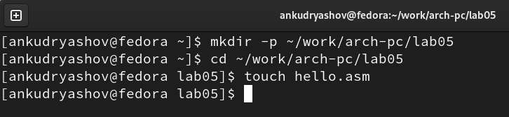{ #fig:001 width=70% }

Теперь откроем созданный файл в текстовом редакторе с помощью команды gedit и запишем туда текст программы (рис. [-@fig:002]).

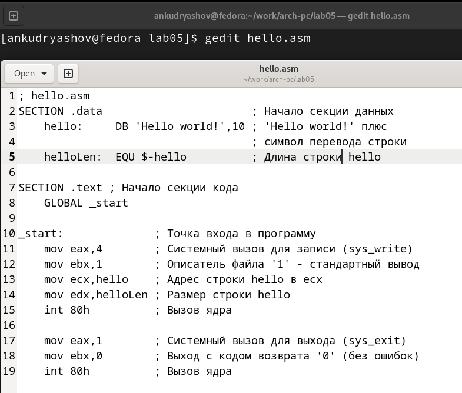{ #fig:002 width=70% }

## Транслятор NASM

Скомпилируем файл hello.asm в файл объектного кода hello.o (рис. [-@fig:003]). С помощью команды ls увидим созданный объектный файл в текущем каталоге. Он имеет расширение .o.

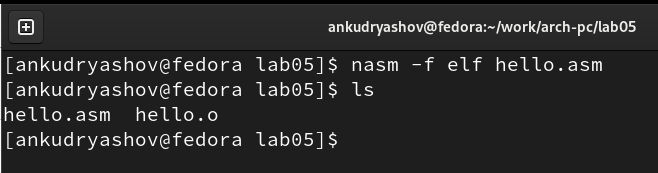{ #fig:003 width=70% }

## Расширенный синтаксис командной строки NASM

Скомпилируем файл hello.obj в obj.o, в помощью специальных ключей -g и -l включим  него символы отладки и создадим файл листинга (рис. [-@fig:004]).

{ #fig:004 width=70% }

## Компоновщик LD

Получим исполняемую программу hello с помощью компановщика (рис. [-@fig:005]).

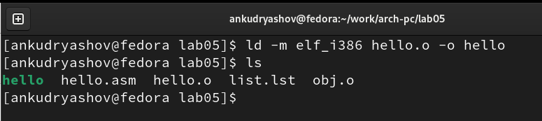{ #fig:005 width=70% }

Используя специальне ключи выполним еще одну команду (рис. [-@fig:006]). Получим исполняемый файл main из объектного файла obj.o.

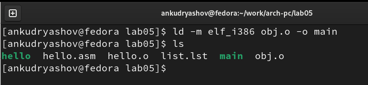{ #fig:006 width=70% }

## Запуск исполняемого файла

Запустим на выполнение созданный исполняемый файл hello с помощью командной строки (рис. [-@fig:007]).

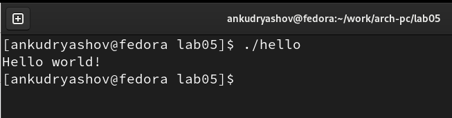{ #fig:007 width=70% }

## Задание для самостоятельной работы

1. Создадим копию файла hello.asm с именем lab5.asm (рис. [-@fig:008]).

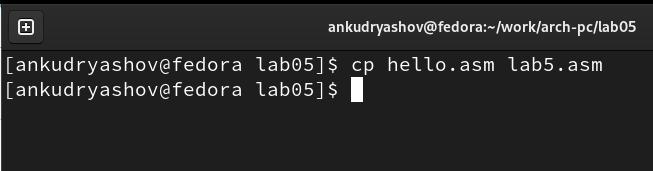{ #fig:008 width=70% }

2. Изменим файл lab5.asm в текстовом редакторе так, чтобы он выводил имя Артём Кудряшов латиницей (рис. [-@fig:009]).

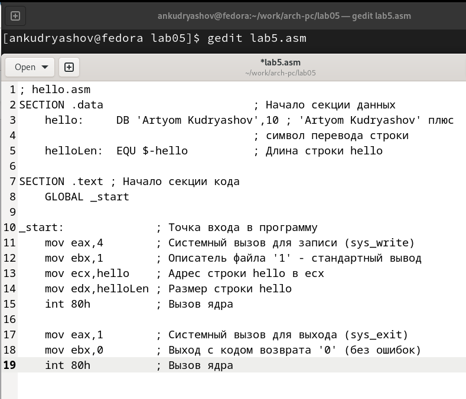{ #fig:009 width=70% }

3. Оттранслируем полученный текст программы в объектный файл, выполним компоновку и запустим получившийся исполняемый файл (рис. [-@fig:010]).

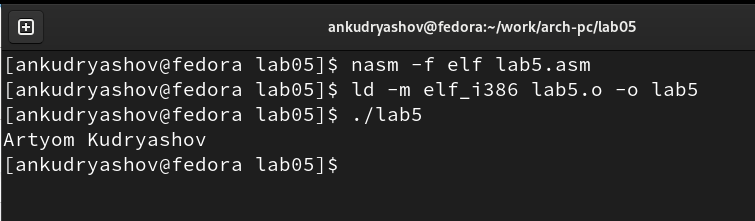{ #fig:010 width=70% }

4. Скопируем файлы hello.asm и lab5.asm в локальный репозиторий в каталог ~/work/study/2022-2023/"Архитектура компьютера"/study_2022-2023_arch-pc/labs/lab05/ (рис. [-@fig:011]).

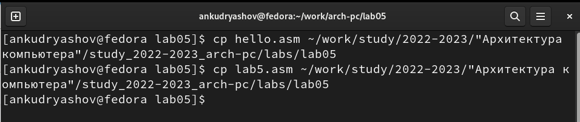{ #fig:011 width=70% }

Отправим изменения на Github (рис. [-@fig:012]).

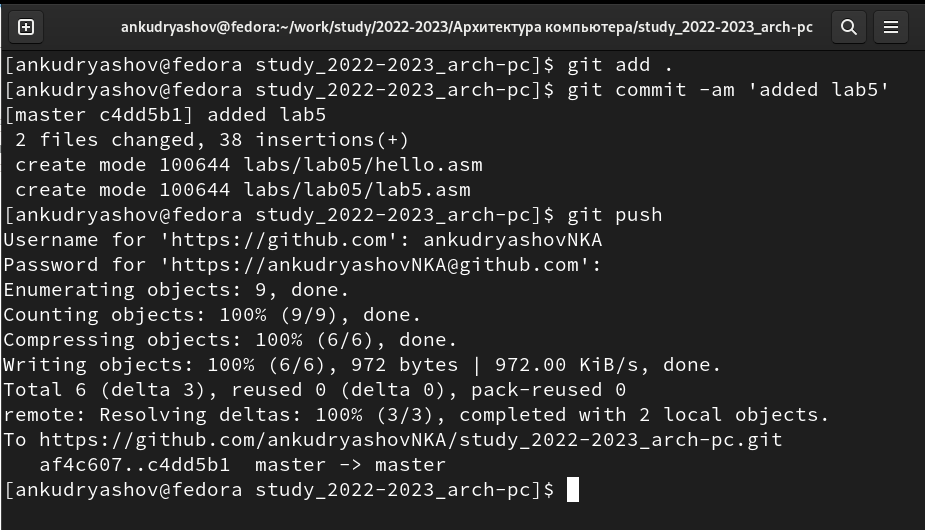{ #fig:012 width=70% }

# Выводы

В результате выполнения лабораторной работы удалось в полной мере освоить процедуры компиляции и сборки программ, написанных на ассемблере NASM.