---
## Front matter
title: "ОТЧЕТ
ПО ЛАБОРАТОРНОЙ РАБОТЕ  №6"
subtitle: "Лабораторная работа №6. Основы работы с Midnight Commander (mc). Структура программы на языке ассемблера NASM. Системные вызовы в ОС GNU Linux"
author: "Кудряшов Артём Николаевич"

## Generic otions
lang: ru-RU
toc-title: "Содержание"

## Bibliography
bibliography: bib/cite.bib
csl: pandoc/csl/gost-r-7-0-5-2008-numeric.csl

## Pdf output format
toc: true # Table of contents
toc-depth: 2
lof: true # List of figures
lot: true # List of tables
fontsize: 12pt
linestretch: 1.5
papersize: a4
documentclass: scrreprt
## I18n polyglossia
polyglossia-lang:
  name: russian
  options:
	- spelling=modern
	- babelshorthands=true
polyglossia-otherlangs:
  name: english
## I18n babel
babel-lang: russian
babel-otherlangs: english
## Fonts
mainfont: PT Serif
romanfont: PT Serif
sansfont: PT Sans
monofont: PT Mono
mainfontoptions: Ligatures=TeX
romanfontoptions: Ligatures=TeX
sansfontoptions: Ligatures=TeX,Scale=MatchLowercase
monofontoptions: Scale=MatchLowercase,Scale=0.9
## Biblatex
biblatex: true
biblio-style: "gost-numeric"
biblatexoptions:
  - parentracker=true
  - backend=biber
  - hyperref=auto
  - language=auto
  - autolang=other*
  - citestyle=gost-numeric
## Pandoc-crossref LaTeX customization
figureTitle: "Рис."
tableTitle: "Таблица"
listingTitle: "Листинг"
lofTitle: "Список иллюстраций"
lotTitle: "Список таблиц"
lolTitle: "Листинги"
## Misc options
indent: true
header-includes:
  - \usepackage{indentfirst}
  - \usepackage{float} # keep figures where there are in the text
  - \floatplacement{figure}{H} # keep figures where there are in the text
---

# Цель работы

Приобретение практических навыков работы в Midnight Commander. Освоение
инструкций языка ассемблера mov и int.

# Задание

Для выполнения данной лабораторнной работы необходимо освоить базовый принцип работы с Midnight Commander. Следует освоить синтаксис программ на языке ассемблера для ввода-вывода текста и системного вызова.

# Выполнение лабораторной работы

Откроем Midnight Commander и перейдём в каталог arch-pc (рис. [-@fig:001]).

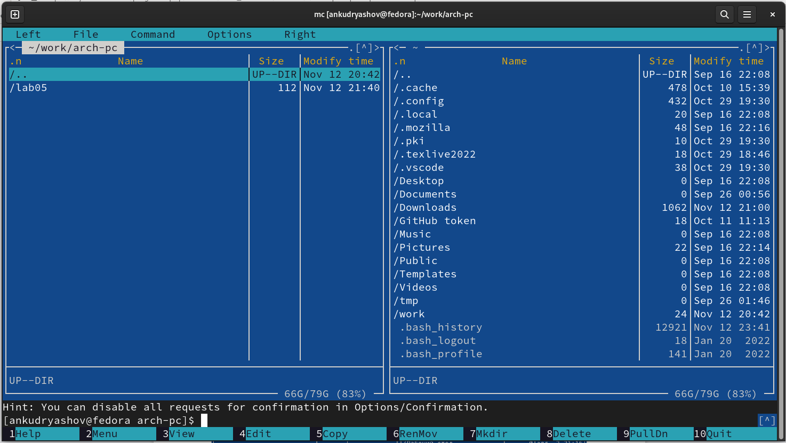{ #fig:001 width=70% }

С помощью клавиши F7 создадим папку lab06, перейдём в неё и, пользуясь строкой ввода и командой touch, создадим файл lab6-1.asm (рис. [-@fig:002]).

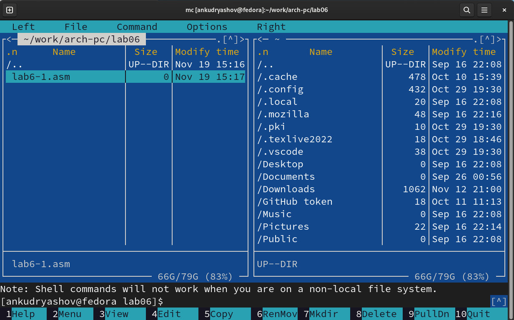{ #fig:002 width=70% }

С помощью функциональной клавиши F4 откроем файл lab6-1.asm для редактирования во встроенном редакторе mcedit и введём текст программы из листинга 6.1. Сохраним изменения и закроем файл (рис. [-@fig:003]).

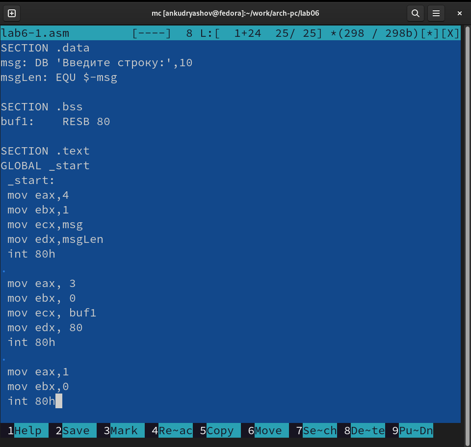{ #fig:003 width=70% }

С помощью клавишы F3 убедимся, что файл содержит текст прграммы. Затем оттранслируем lab6-1.asm в объектный файл, выполним компоновку и запустим получившийся исполняемый файл (рис. [-@fig:004]).

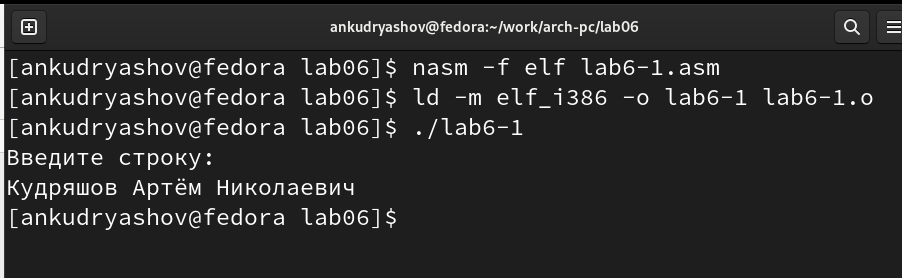{ #fig:004 width=70% }

## Подключение внешнего файла in_out.asm

Скачаем файл in_out.asm и скопирем в каталог с файлом lab6-1.asm с помощью клавиши F5 (рис. [-@fig:005]).

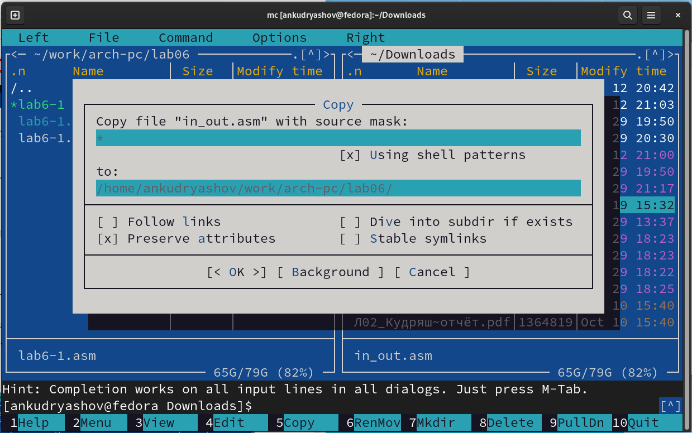{ #fig:005 width=70% }

Создадим копию файла lab6-1.asm с именем lab6-2.asm (рис. [-@fig:006]).

{ #fig:006 width=70% }

Исправим текст программы в файле lab6-2.asm с использование под-
программ из внешнего файла in_out.asm (рис. [-@fig:007]).

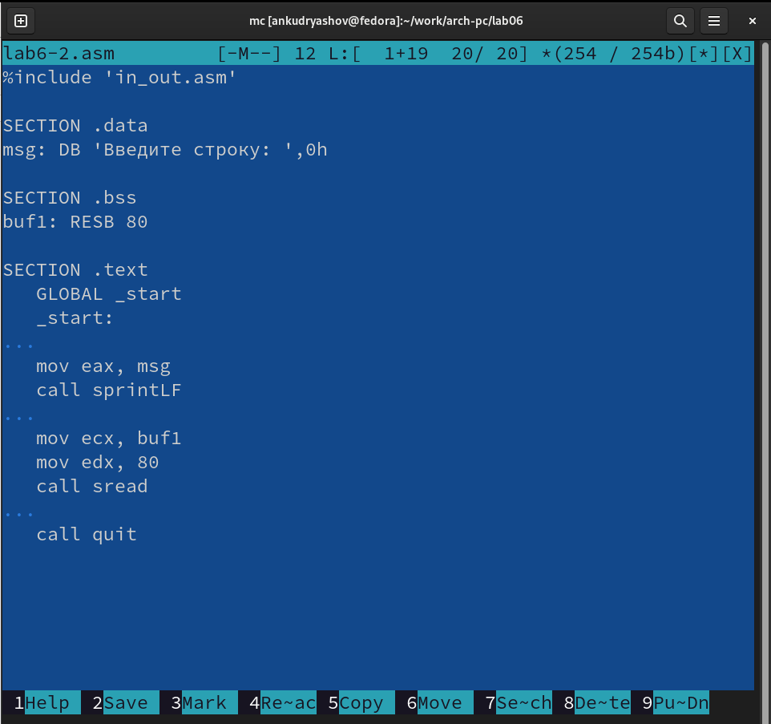{ #fig:007 width=70% }

Оттранслируем и скомпануем файл. Запустим исполняемый файл lab6-2 (рис. [-@fig:008]).

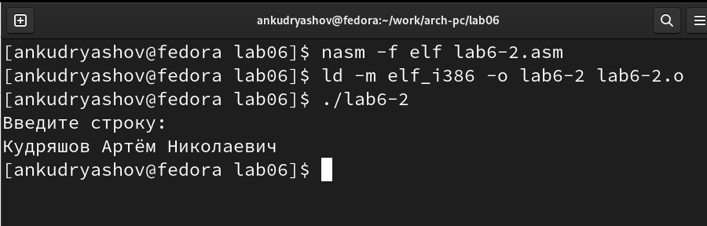{ #fig:008 width=70% }

Заменим в тексте программы подпрограмму sprintLF на sprint и проверим работу нового исполняемого файла. Теперь после слов "Введите строку: " не следует перевода строки (рис. [-@fig:009]).

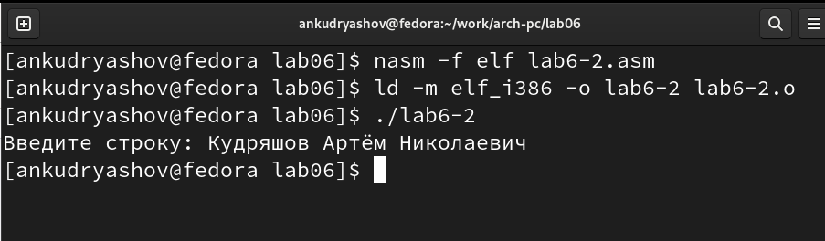{ #fig:009 width=70% }

## Задание для самостоятельной работы

1. Создадим копию файла lab6-1.asm и именем lab6-1_copy.asm и внесем изменения в соответствии с требованиями заданий для самостоятельной работы (рис. [-@fig:010]).

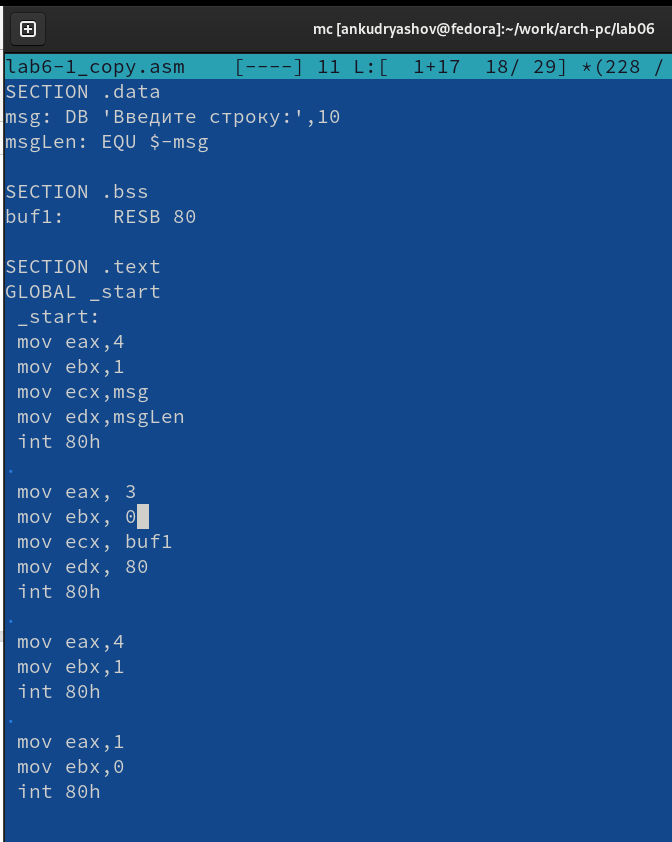{ #fig:010 width=70% }

2. Получим исполняемый файл и проверим его работу. Как мы видим, после считывания строка выводится еще раз через стандартный вывод (рис. [-@fig:011]).

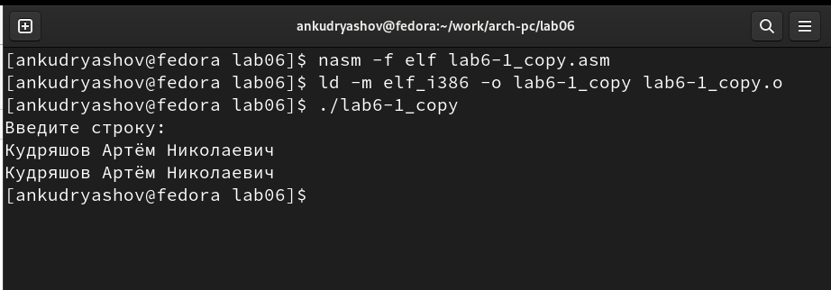{ #fig:011 width=70% }

3. Создадим копию файла lab6-2.asm и именем lab6-2_copy.asm и внесем изменения в соответствии с требованиями заданий для самостоятельной работы  (рис. [-@fig:012]).

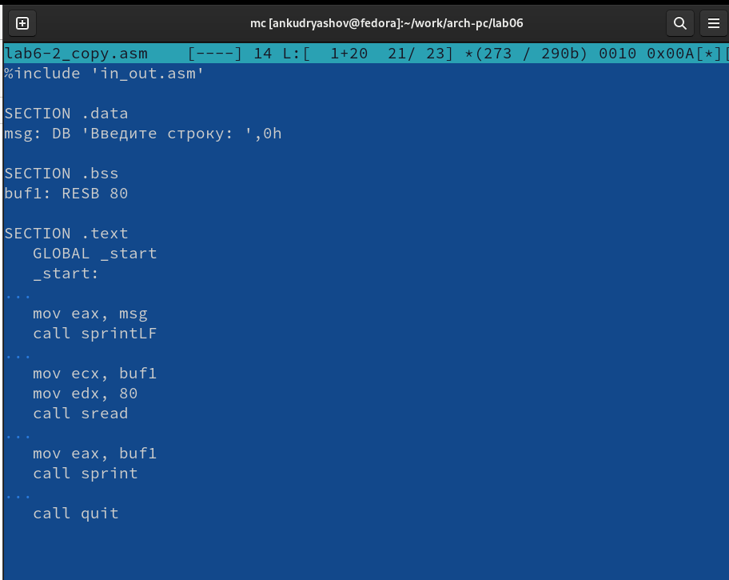{ #fig:012 width=70% }

4. Получим исполняемый файл и проверим его работу. Как мы видим, после считывания строка вновь выводится через стандартный вывод. Только теперь были использованы подпрограммы из файла in_out.asm (рис. [-@fig:013]).

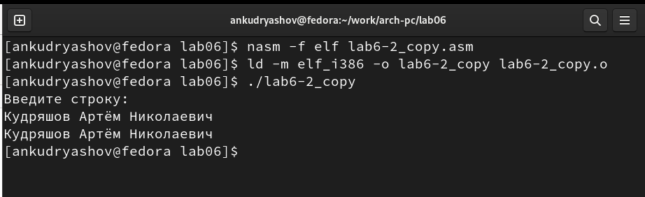{ #fig:013 width=70% }

# Выводы

В результате выполнения лабораторной работы удалось в полной мере освоить принципы работы в Midnight Commander и работу с вводом-выводом, инструкциями mov и int языка ассемблера.