---
## Front matter
title: "ОТЧЕТ
ПО ЛАБОРАТОРНОЙ РАБОТЕ  №7"
subtitle: "Лабораторная работа №7. Арифметические операции в NASM."
author: "Кудряшов Артём Николаевич"

## Generic otions
lang: ru-RU
toc-title: "Содержание"

## Bibliography
bibliography: bib/cite.bib
csl: pandoc/csl/gost-r-7-0-5-2008-numeric.csl

## Pdf output format
toc: true # Table of contents
toc-depth: 2
lof: true # List of figures
lot: true # List of tables
fontsize: 12pt
linestretch: 1.5
papersize: a4
documentclass: scrreprt
## I18n polyglossia
polyglossia-lang:
  name: russian
  options:
	- spelling=modern
	- babelshorthands=true
polyglossia-otherlangs:
  name: english
## I18n babel
babel-lang: russian
babel-otherlangs: english
## Fonts
mainfont: PT Serif
romanfont: PT Serif
sansfont: PT Sans
monofont: PT Mono
mainfontoptions: Ligatures=TeX
romanfontoptions: Ligatures=TeX
sansfontoptions: Ligatures=TeX,Scale=MatchLowercase
monofontoptions: Scale=MatchLowercase,Scale=0.9
## Biblatex
biblatex: true
biblio-style: "gost-numeric"
biblatexoptions:
  - parentracker=true
  - backend=biber
  - hyperref=auto
  - language=auto
  - autolang=other*
  - citestyle=gost-numeric
## Pandoc-crossref LaTeX customization
figureTitle: "Рис."
tableTitle: "Таблица"
listingTitle: "Листинг"
lofTitle: "Список иллюстраций"
lotTitle: "Список таблиц"
lolTitle: "Листинги"
## Misc options
indent: true
header-includes:
  - \usepackage{indentfirst}
  - \usepackage{float} # keep figures where there are in the text
  - \floatplacement{figure}{H} # keep figures where there are in the text
---

# Цель работы

Освоение арифметических инструкций языка ассемблера NASM.

# Задание

Для выполнения данной лабораторнной работы необходимо освоить принцип работы с арифметическими инструкциями языка ассемблера NASM. Для этого следует разобрать различные операторы, используемые для сложения, вычитания, умножения, деления, а также перевода символьного типа в числовой. 

# Выполнение лабораторной работы

## Символьные и численные данные в NASM

Откроем терминал, создадим каталог для програм в папке arch-pc и с помощью команды touch создадим первый файл lab7-1.asm (рис. [-@fig:001]).

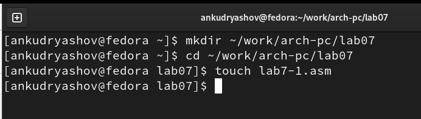{ #fig:001 width=70% }

Введём в файл lab7-1.asm текст программы из листинга 7.1 (рис. [-@fig:002]).

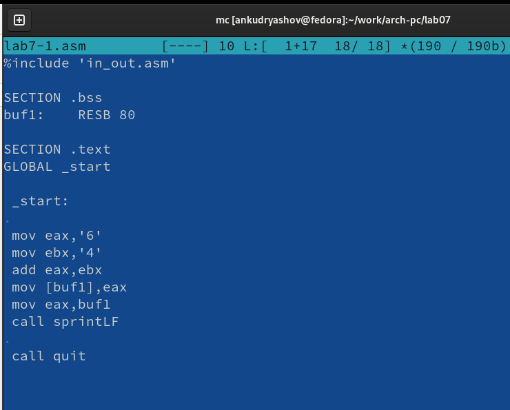{ #fig:002 width=70% }

Создадим исполняемый файл и запустим его. Как мы видим, программа вывела на экран символ 'j' (рис. [-@fig:003]).

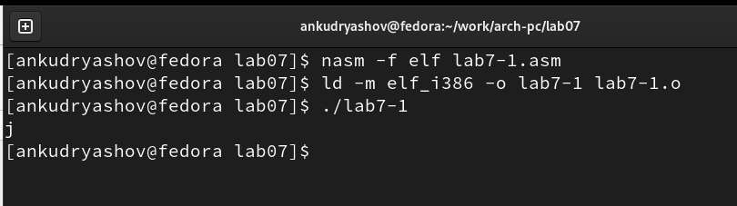{ #fig:003 width=70% }

Немного изменим текст программы, записав в регистры числа, а не символы (поменяем mov eax,'6' на mov eax,6 и т.д.). Создадим исполняемый файл и запустим его. В этот раз на экран вывелся символ  LF, т.е. перевод строки, потому что его номер в таблице символов ASCII равен 10 (т.к 6+4) (рис. [-@fig:004]).

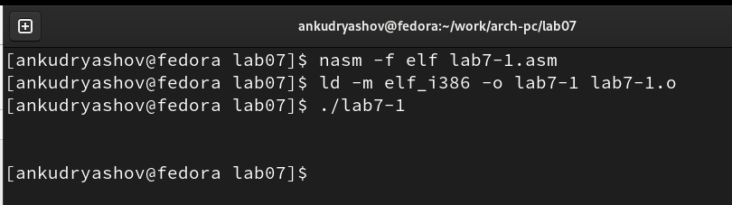{ #fig:004 width=70% }

В нашем каталоге создадим файл lab7-2.asm. Введём в него текст программы из листинга 7.2 (рис. [-@fig:005]).

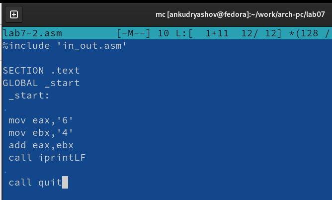{ #fig:005 width=70% }

Вновь создадим исполняемый файл и запустим его. На этот раз программа выводит на экран число 106 (сумма ASCII кодов 54 + 52) (рис. [-@fig:006]).

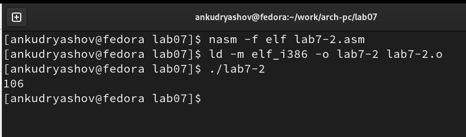{ #fig:006 width=70% }

Аналогично предыдущеиу примеру изменим символы на числа. В этот раз программа выведет на экран число 10, т.е. сумму чисел 6 и 4 (рис. [-@fig:007]).

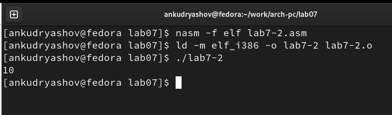{ #fig:007 width=70% }

Заменим функцию iprintLF на iprint. Создадим и запустим исполняемый файл. Теперь программа выводит число 10, но не ставит после него перевод строки (рис. [-@fig:008]).

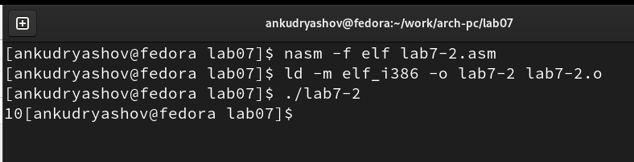{ #fig:008 width=70% }

## Выполнение арифметических операций в NASM

Вычислим значение функции f(x) = (5*2 + 3)/3. Создадим файл lab7-3.asm и скопируем в него текст программы из листинга 7.3 (рис. [-@fig:009]).

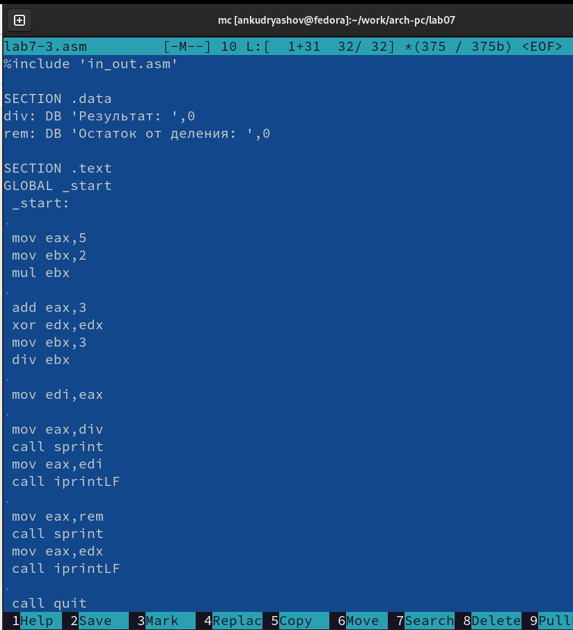{ #fig:009 width=70% }

Создадим исполняемый файл и запустим его. Увидим в выводе целую часть ответа 4 и остаток от деления 1 (рис. [-@fig:010]).

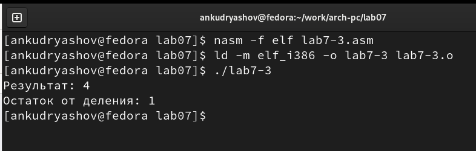{ #fig:010 width=70% }

Изменим текст программы так, чтобы она вычисляла f(x) = (4*6 + 2)/5 (рис. [-@fig:011]).

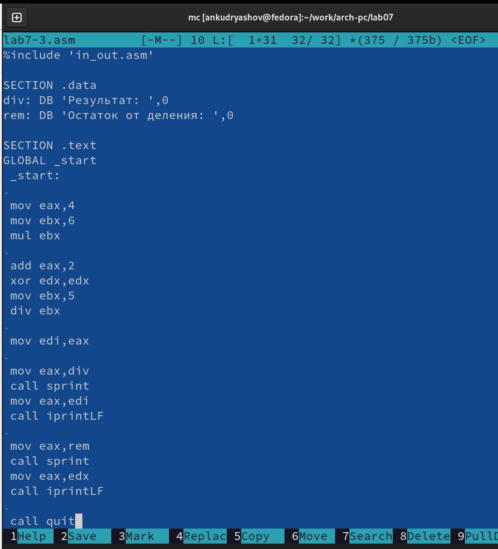{ #fig:011 width=70% }

Создадим и запустим исполняемый файл (рис. [-@fig:012]).

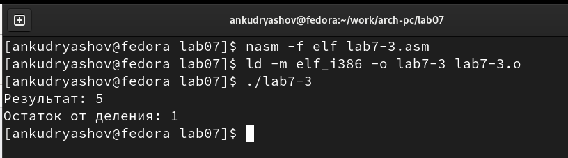{ #fig:012 width=70% }

В качестве еще одного примера создадим программу вычисления варианта задания по номеру студенческого билета. Скопируем в файл variant.asm текст программы из листинга 7.4 (рис. [-@fig:013]).

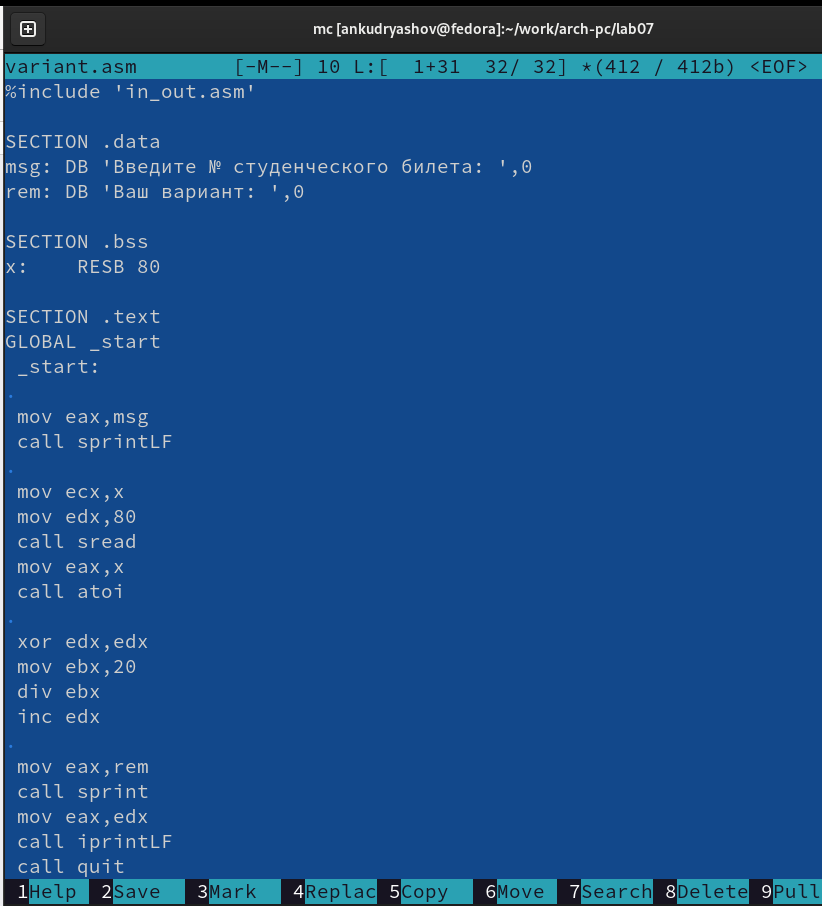{ #fig:013 width=70% }

В результате выполнения получим вариант №14. Проверим: 1132226433 % 20 = 13, 13 + 1 = 14, верно (рис. [-@fig:014]).

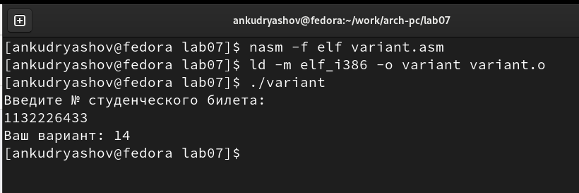{ #fig:014 width=70% }

### Ответы на вопросы

1. Какие строки листинга 7.4 отвечают за вывод на экран сообщения ‘Ваш
вариант:’?
Переменная rem хранит текст 'Ваш вариант: ', в строке mov eax,rem адрес rem помещается в eax, затем в строке call sprint значение из eax выводится на экран.

2. Для чего используется следующие инструкции? nasm mov ecx, x
mov edx, 80 call sread
Для считывания значения переменной x от пользователя. Первая инструкция указывает, что записать результат считывания нужно в x, вторая инструкция указывает максимальную длину строки, последняя инструкция вызывает функцию, считывающую значение, введённое пользователем.

3. Для чего используется инструкция “call atoi”?
Для преобразования ASCII кода в число

4. Какие строки листинга 7.4 отвечают за вычисления варианта?
mov ebx,20
div ebx
inc edx

5. В какой регистр записывается остаток от деления при выполнении ин-
струкции “div ebx”?
В регистр edx.

6. Для чего используется инструкция “inc edx”?
Для увеличения значения, хранящегося в edx на 1.

7. Какие строки листинга 7.4 отвечают за вывод на экран результата вычис-
лений?
mov eax,rem
call sprint
mov eax,edx
call iprintLF
Здесь первые две строки выводят на экран сообщение 'Ваш вариант: ', а вторые две строки выводят сам номер варианта, посчитанный в ходе работы программы.

## Задание для самостоятельной работы

Получили вариант №14. Функция имеет вид f(x) = (x/2 + 8)*3, а x1 и x2 равны 1 и 4 соответственно. Создадим файл lab7-sr.asm и запишем туда текст программы, выполняющей необходимые вычисления (рис. [-@fig:015]).

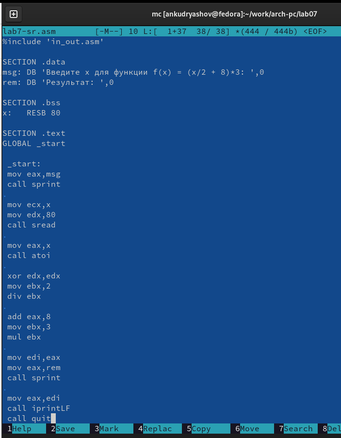{ #fig:015 width=70% }

Создадим и запустим исполняемый файл lab7-sr. Введём значение 1. Получим (1/2 + 8)•3 = 8•3 = 24. Теперь введём значение 4. Получим (4/2 + 8)•3 = 10•3 = 30. Всё верно (рис. [-@fig:016]).

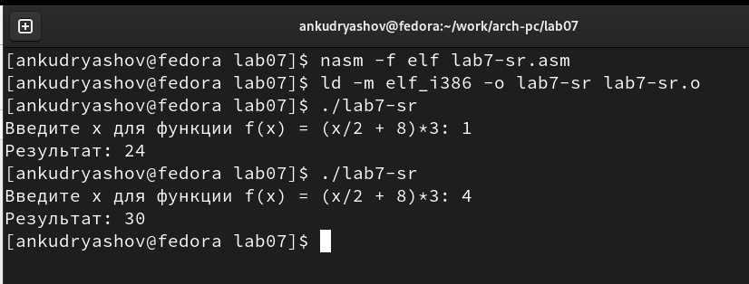{ #fig:016 width=70% }

# Выводы

В результате выполнения лабораторной работы удалось в полной мере освоить работу с арифметическими операциями и переводом из символьного в числовой тип на языке ассемблера NASM.